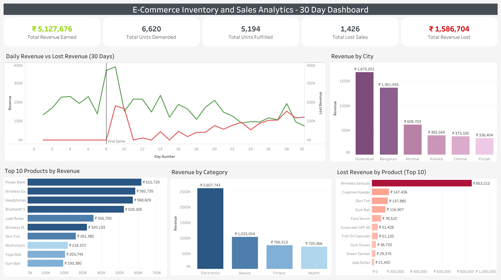

# E-Commerce Inventory & Sales Analytics Pipeline

## Business Problem
E-commerce businesses lose revenue when products run out of stock and there is no system in place to detect it early enough. This project builds a fully automated data pipeline that simulates 30 days of daily sales across 20 products and 6 cities, stores clean data in a SQL database, runs proactive reorder alerts every 5 days, and analyses stockout impact so the business can make smarter restocking decisions.

## How the Pipeline Works
```text
generate_data.py -> today.csv -> etl_pipeline.py -> sales.db
|
analysis_report.py (every 5 days)
|
insights.ipynb (manual)
```

1. `generate_data.py` checks the database for the last recorded day and generates that day's orders with realistic messy customer data.
2. Saves to `today.csv` - a temporary handoff file.
3. `etl_pipeline.py` reads `today.csv`, cleans all data quality issues, appends clean rows to `sales.db`, then deletes `today.csv`.
4. `scheduler.py` automates steps 1 to 3 daily and triggers `analysis_report.py` every 5 days.
5. `analysis_report.py` runs proactive reorder alerts, generates charts, and saves a text report automatically.
6. `insights.ipynb` is run manually by the analyst for deep-dive analysis, business interpretation, and actionable recommendations.

## Automated Alert System
The pipeline uses a two-level proactive alert system:

- **WARNING** - stock drops below average daily sales x 2. The business still has time to reorder before stockout.
- **CRITICAL** - stock has already hit zero and revenue is actively being lost. Immediate reorder required.

The Day 15 report flagged Creatine Powder at WARNING with 2 units remaining - 5 days before it fully stocked out. This is the core value of proactive vs reactive monitoring.

## Pipeline Log
`full_30_day_log.txt` contains a record of every pipeline run - date, day number, rows loaded, orders generated and revenue figures. This demonstrates the scheduler ran successfully for all 30 days.

## Key Findings
- Wireless Earbuds generated Rs. 5,82,735 in revenue but caused Rs. 8,53,212 in lost sales after going viral on Day 8 - stock depleted within 1 day of the spike.
- First stockout detected automatically on Day 10 report - 21 days before manual analysis would have found it.
- Automated WARNING alert fired on Day 15 for Creatine Powder with 2 units left - before the stockout happened.
- Kolkata had the highest loss rate at 31%.
- Hyderabad drives 32.6% of all sales - highest demand city.
- Electronics accounts for 51% of total revenue.
- UPI is the dominant payment method at 41.2% of transactions.
- 15 out of 20 products experienced stockouts by Day 30.
- Total revenue earned: Rs. 51,27,676.
- Total revenue lost  : Rs. 15,86,704.

## Recommendations
- Implement dynamic reorder threshold at average daily sales × 2 - gives a 2-day buffer before stockout.
- Prioritise Hyderabad and Bengaluru for restocking - together they account for over 60% of total revenue.
- Use rec_stock_30d values from analysis as warehouse order quantities for the next period.
- Review Electronics category weekly - single viral product can cascade into category-wide shortfalls.

## Data Quality Issues Handled by ETL
| Issue | How it was fixed |
|---|---|
| Missing customer names | Filled with "Unknown" |
| Missing phone numbers | Filled with "Unknown" |
| Missing city values | Filled with "Unknown" |
| Wrong text casing | Fixed with `.str.title()` |
| Phone formatting (dashes, spaces) | Cleaned with `.str.replace()` |
| Duplicate orders | Removed with `drop_duplicates()` |
| Invalid phone lengths | Flagged in `phone_valid` column |
| No-space names (RaviSharma) | Standardised with regex |

## Tech Stack
- **Python** - core language
- **Pandas** - data cleaning and transformation
- **SQLite** - database storage
- **SQLAlchemy** - Python to SQL connection
- **Matplotlib + Seaborn** - charts and visualizations
- **Schedule** - Data generation and ETL pipeline automation
- **Tableau Public** - interactive business dashboard

## Dashboard
Interactive Tableau Public dashboard showing 30-day sales trends, category performance, city demand, and stockout impact.

[View Live Dashboard](https://public.tableau.com/views/E-CommerceInventoryandSalesAnalyticsPipeline/E-CommerceSalesDashboard)



## Project Structure
```text
ecommerce-inventory-pipeline/
├── analysis/
│   ├── auto_charts/
│   │   ├── day_05/
│   │   ├── day_10/
│   │   ├── day_15/
│   │   ├── day_20/
│   │   ├── day_25/
│   │   └── day_30/
│   ├── charts/
│   │   ├── payment_methods.png
│   │   ├── q1_capture_rate.png
│   │   ├── q2_stockout_timeline.png
│   │   ├── q3_city_impact.png
│   ├── reports/
│   │   ├── report_day05.txt
│   │   ├── report_day10.txt
│   │   ├── report_day15.txt
│   │   ├── report_day20.txt
│   │   ├── report_day25.txt
│   │   └── report_day30.txt
│   └── insights.ipynb
├── data/
│   └── generate_data.py
│   └── final_sales_data.csv
├── database/
│   └── sales.db
├── pipeline/
│   ├── analysis_report.py
│   └── etl_pipeline.py
├── queries/
│   ├── city_demand.sql
│   ├── lost_revenue.sql
│   ├── reorder_alert.sql
│   ├── revenue_by_category.sql
│   └── top_products.sql
├── full_30_day_log.txt
├── .gitignore
├── .gitattributes
├── LICENSE
├── README.md
└── scheduler.py
```

## How to Run

### Install dependencies
```bash
pip install pandas numpy sqlalchemy matplotlib seaborn schedule jupyter
```

### Run the scheduler to simulate all 30 days with automated analysis
```bash
python scheduler.py
```

### Open deep-dive analysis notebook
```bash
jupyter notebook analysis/insights.ipynb
```